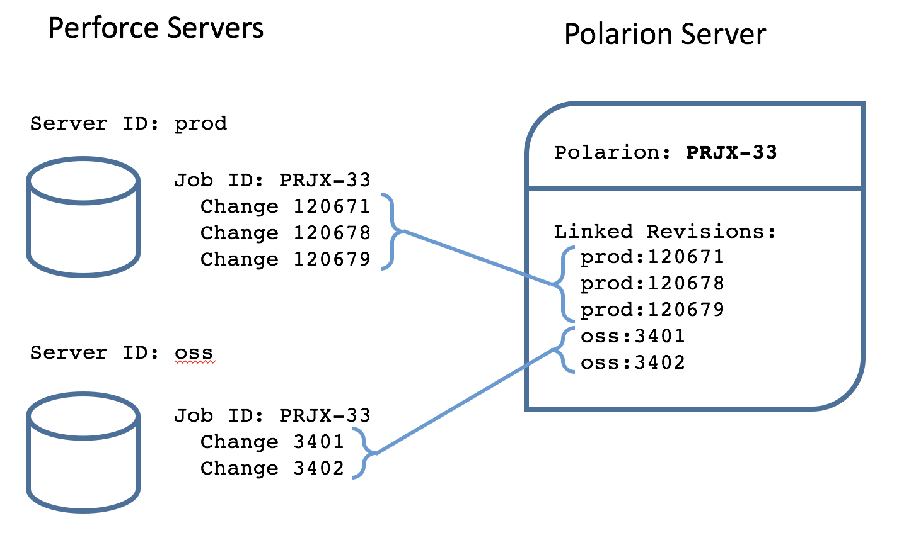
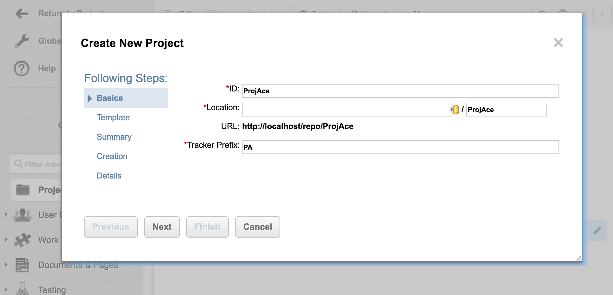
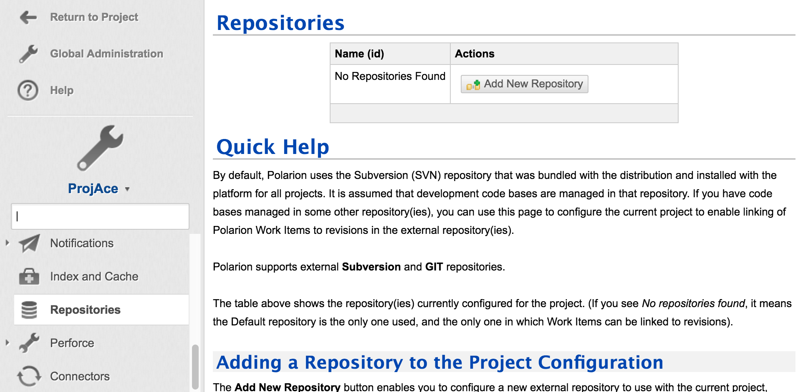
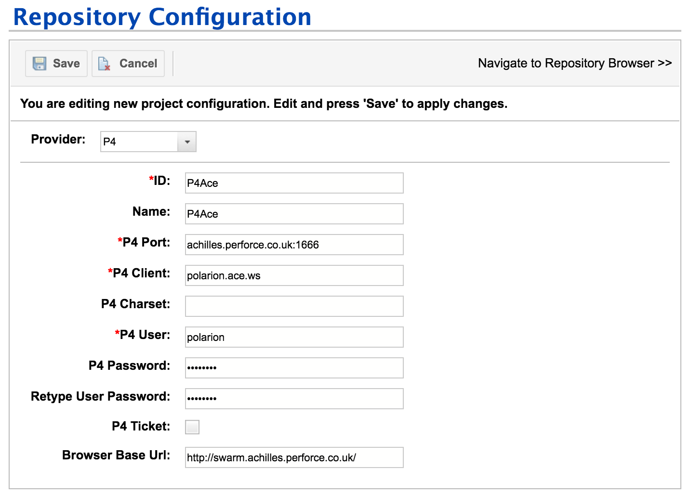
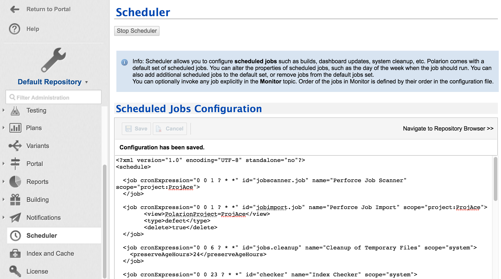

# Polarion Integration

## About This Project

P4Polarion is an integration for Perforce with the [Polarion ALM system](https://www.polarion.com)

## Support

This integration is not supported by Perforce Support.

## License

Please refer to
[LICENSE](https://swarm.workshop.perforce.com/projects/perforce_software-p4polarion/files/main/LICENSE).

## Requirements

* Perforce Server version 2014.1 or greater
* Polarion ALM version 2015 or greater
* Java Runtime 1.7 or greater

## Overview

The Perforce integration for Polarion fills two main functions:

1. Perforce Changelist picker for Polarion WorkItems
2. Perforce Job and Polarion WorkItem replication

## Job and WorkItem Replication

The plugin uses Polarion as the Master for Perforce Job to Polarion WorkItem replication.  Any changes to a WorkItem in Polarion are immediately replicated to the corresponding Job in Perforce.  Changes to Perforce Jobs are replicated to Polarion, based on a Scheduled Polarion 'Scan Job' task.

Only Jobs in Perforce that were added by Polarion are replicated, standard Perforce Jobs (job000001) are not replicated.  Polarion must Import new Perforce Jobs using the Scheduled Polarion 'Import Jobs' task.  Various filters and the Polarion Project destinations can be specified in the Import task.

### WorkItem to Job replication

The fields replicated between Perforce Jobs and Polarion WorkItems are fixed, the following table outlines their relationships:

WorkItem (id)     | Replacation             | Job (field)
------------------|:-----------------------:|-------------
`id`              | `CREATE`-->             | `Job`
`project`         | `CREATE`-->             | `PolarionProject`
`description`     | <--`CREATE|UPDATE`-->   | `Description`
`title`           | <--`CREATE|UPDATE`-->   | `PolarionTitle`
`status`          | <--`CREATE|UPDATE`-->   | `PolarionStatus`
`author`          | `CREATE`-->             | `ReportedBy`
`linkedRevisions` | <--`CREATE|UPDATE`-->   | (`p4 fixes`)

### Multiple Perforce 'repository' connections

In a situation where more than one Perforce repository is connected to a Polarion Project, the WorkItem 'Linked Revisions' will link a Perforce change and update the corresponding 'fix' record on the Perforce server.



## Installation

### Perforce Server Connection

*NOTE: this step is required for the 'Changelist picker' and 'Job replication'.*

First of all create a Polarion Project (if you don't have one already)

* Click on the Settings 'cog' dropdown at the top left.
* Select 'Administration'
* Click 'New Project' from the project panel

Fill out the popup form as required, for example:



On the 'Administration' panel, if 'Default Repository' is listed, then select your project from the dropdown.

Browse the option list on the left and select 'Repositories'.

Click on the 'Add New Repository' button (or 'Add Below' if one or more already exists).



Fill out the Repository Configuration as required.  You will need to specify a fully qualified domain name and port for 'P4 Port' ensuring it is visible to Polarion.  A Perforce Workspace 'P4 Client' is required to filer the changes visible to the Polarion Project.  Provide a Perforce user for Polarion to use to access Jobs and browse changelists.

For example;



The 'Browser Base Url' is optional and used to link Perforce Swarm review tool.

### JobSpec configuration

*NOTE: the following step are only required for 'Job replication'.*

Use the `p4 jobspec` command to update the Perforce Jobspec to match the minimum fields required for the Polarion integration.

The following table outlines the required fields and their attributes:

field-name        | data-type     | length    | field-type    | preset
------------------|---------------|-----------|---------------|--------------
`Job`             | word          | 32        | required      |
`Status`          | select        | 10        | required      |
`Description`     | text          | 0         | required      | `$blank`
`ReportedBy`      | word          | 32        | required      | `$user`
`ReportedDate`    | date          | 20        | once          | `$now`
`ModifiedBy`      | word          | 20        | always        | `$user`
`ModifiedDate`    | date          | 20        | always        | `$now`
`PolarionTitle`   | text          | 80        | required      |
`PolarionProject` | word          | 32        | required      |
`PolarionLink`    | word          | 128       | optional      |
`PolarionStatus`  | word          | 20        | optional      | 'open'

For example; here is a sample Job spec:

```
Fields:
        101 Job word 32 required
        102 Status select 10 required
        105 Description text 0 required
        107 ReportedBy word 32 required
        109 ReportedDate date 20 once
        110 ModifiedBy word 20 always
        111 ModifiedDate date 20 always
        112 PolarionTitle text 80 required
        113 PolarionProject word 20 required
        114 PolarionLink text 128 optional
        115 PolarionStatus word 20 required

Presets:
        Status open
        PolarionStatus open
        Description $blank
        ReportedBy $user
        ReportedDate $now
        ModifiedBy $user
        ModifiedDate $now
        PolarionStatus open
```

Please note the default `User` and `Date` fields have been removed.

### Perforce Properties

To specify the Polarion Server address used by Swarm to link within a Perforce Job, use the following command (requires 'admin' level permission):

```
p4 property -a -n Polarion.Server.Url -v http://test.polarion.com
```

### Perforce Counters

The Perforce Polarion integration uses two Perforce counters to track Job Scanning and Import tasks.  These counters should not be modified, unless one system is out of sequence with the other.

Stores the last scan in Perforce Server time using Epoch in seconds.

`p4 counter Polarion.Job.Time` (Default start value: 0)

Stores the last import in Perforce Server time using Epoch in seconds.

`p4 counter Polarion.Import.Time` (Default start value: 0)

### Scan Jobs (Polarion CRON)

Scans for 'user' modified Perforce Jobs and updates the Polarion WorkItem.

```
<job name="Perforce Job Scanner"
     id="jobscanner.job"
     cronExpression="0 0 1 ? * *"
     scope="project:paul">
</job>
```

### Import Jobs (Polarion CRON)

Imports new 'user' added Perforce Jobs (based on ReportedDate) and create new Polarion WorkItems setting the WorkItem Type filed and assigning to a Polarion Project.

```
<job name="Perforce Job Import"
     id="jobimport.job"
     cronExpression="0 0 1 ? * *"
     scope="project:paul">

	<view>PolarionProject=paul</view>
	<type>defect</type>
	<delete>false</delete>
</job>
```

For example, a sample Perforce Job Scanner and Import cron entry:


